<h1 align="center">🇪🇬 Egypt Electronic Voting System</h1>

<p align="center">
React Admin Dashboard
</p>

<p align="center">
Frontend Web Application developed as part of the Egypt Electronic Voting System Graduation Project.
</p>

---


---

> [!IMPORTANT]
>
> ## Repository Scope
>
> **This repository contains ONLY the React Admin Dashboard frontend source code.**
>
> The complete graduation project consists of multiple independent components.
>
> **The following components are NOT included in this repository:**
>
> - Flutter Mobile Application
> - FastAPI Backend
> - SQLite Database
> - Supabase
> - AI Face Recognition Module
> - OCR National ID Verification
> - Any backend source code
>
> This repository is intended to demonstrate the **React frontend implementation** developed for the administrative dashboard.

---

# 📌 Project Overview

The Egypt Electronic Voting System is a graduation project developed to provide a secure electronic voting platform for Egyptian elections.

The complete system consists of several integrated components working together to deliver a secure and transparent voting experience.

## Complete Graduation Project

| Component | Technology | Included |
|-----------|------------|----------|
| Mobile Application | Flutter | ❌ |
| Backend API | FastAPI | ❌ |
| Database | SQLite + Supabase | ❌ |
| AI Face Recognition | Python | ❌ |
| OCR Verification | Python | ❌ |
| React Admin Dashboard | React.js | ✅ This Repository |

---

# 🏗 React Admin Dashboard

The Admin Dashboard is responsible for managing every administrative operation inside the voting system.

It allows election administrators to:

- Manage Elections
- Approve Candidates
- Manage Electoral Districts
- Manage Political Parties
- Monitor Votes
- Monitor Voters
- Display Election Results
- Review Candidate Documents
- Manage Contact Messages
- Respond to User Reports

---

# ✨ Features

## 🔐 Authentication

- Secure Login
- Protected Routes
- Administrator Authentication

---

## 🗳 Election Management

- Create Elections
- Edit Elections
- Delete Elections
- View Election Details

---

## 👨‍💼 Admin Management

- Add Admin
- View Admins
- Delete Admin

---

## 👤 Candidate Management

- Candidate Approval
- Candidate Details
- Candidate Image Viewer
- Accepted Candidates

---

## 🏛 Electoral District Management

- View Districts
- Add District
- Edit District

---

## 🏢 Political Party Management

- View Political Parties
- Search Political Parties

---

## 🗳 Voting Management

- View Votes
- View Voters
- Monitor Election Activity

---

## 📊 Election Results

- Display Results
- Candidate Statistics

---

## 📩 Communication

- Contact Messages
- Reply System
- Problem Reports

---

# 🛠 Tech Stack

## Frontend

- React.js
- JavaScript (ES6)
- HTML5
- CSS3
- React Router DOM
- Axios

---

## Backend (Not Included)

- FastAPI
- Python

---

## Database (Not Included)

- SQLite
- Supabase

---

## AI Technologies (Not Included)

- Face Recognition
- OCR
- National ID Verification

---

# 📂 Project Structure

```text
my-app/

├── public/

├── src/

├── assets/
│ └── screenshots/

├── package.json

├── package-lock.json

└── README.md
```

---

# 📸 Admin Dashboard Screenshots

The following screenshots demonstrate the React Admin Dashboard included in this repository.
## 🔐 Login

Administrator authentication page.

<p align="center">
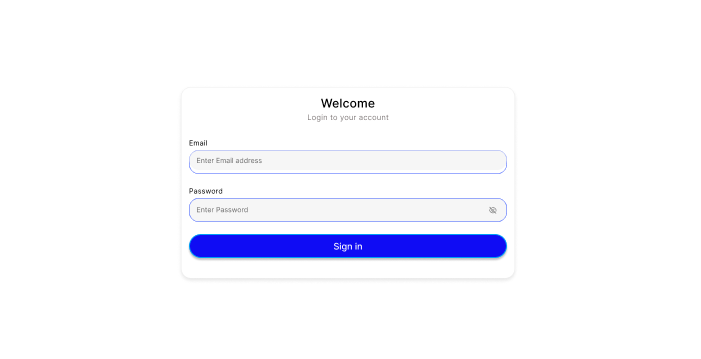
</p>

---

# 👨‍💼 Admin Management

<p align="center">
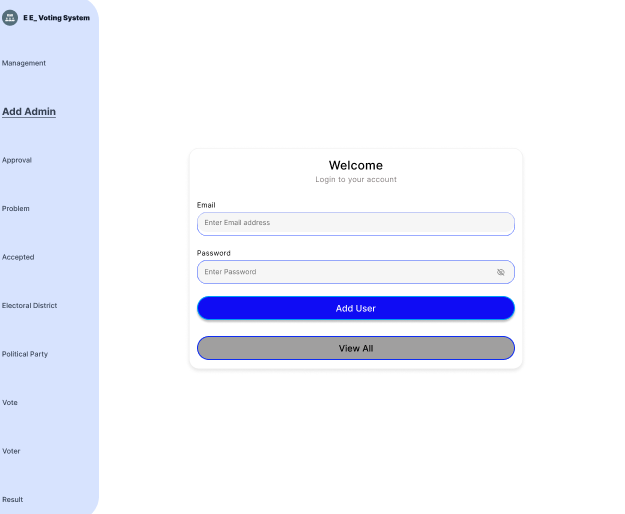
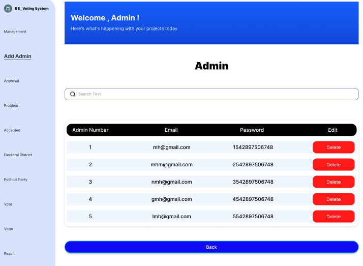
</p>

Administrators can create new administrator accounts and manage existing ones through a simple interface.

---

# 🗳 Election Management

<p align="center">
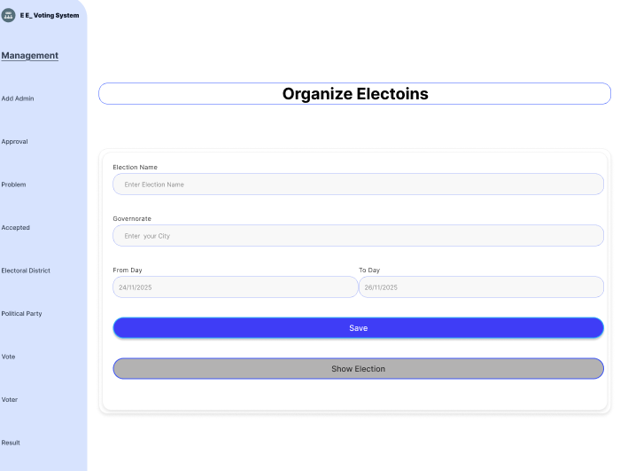
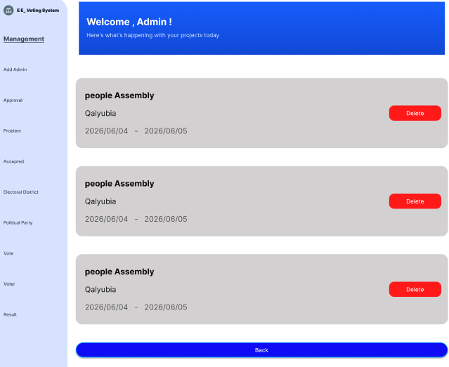
</p>

<p align="center">
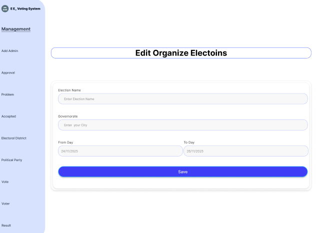
</p>

The dashboard allows administrators to create, edit and monitor elections from a centralized interface.

---

# 🏛 Electoral District Management

<p align="center">
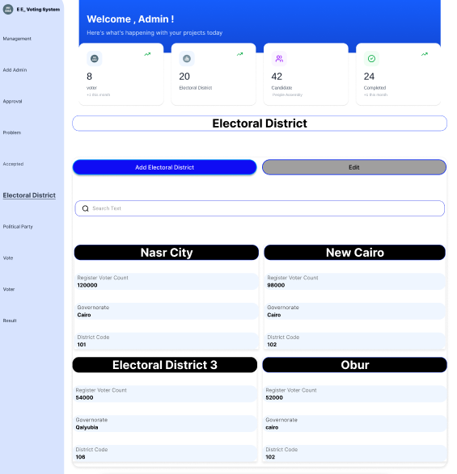
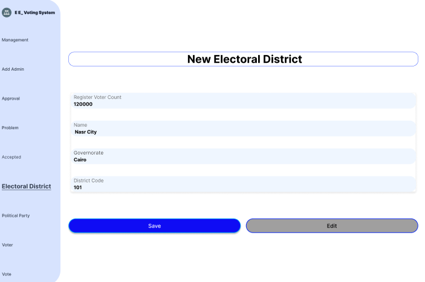
</p>

<p align="center">
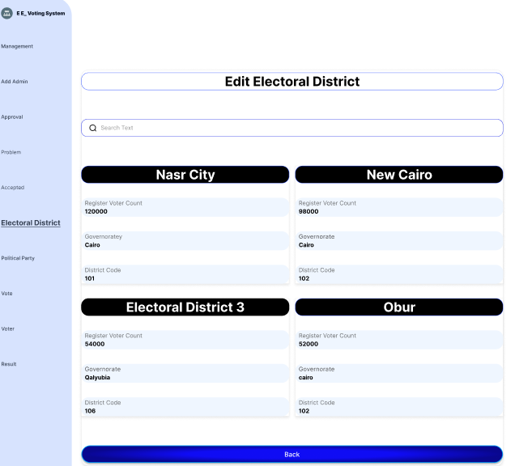
</p>

Election districts can be viewed, added and updated easily.

---

# 🏢 Political Party Management

<p align="center">
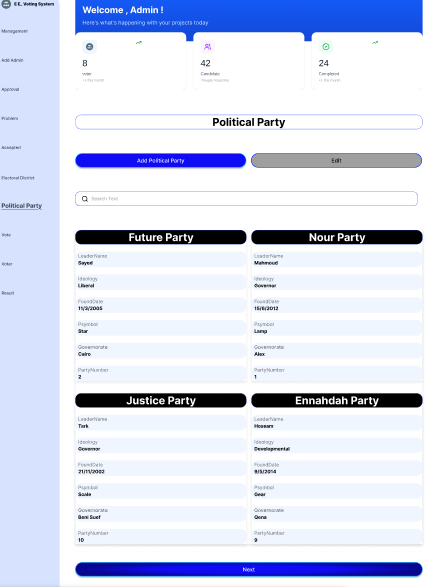
</p>

Manage all registered political parties participating in elections.

---

# 👤 Candidate Management

<p align="center">
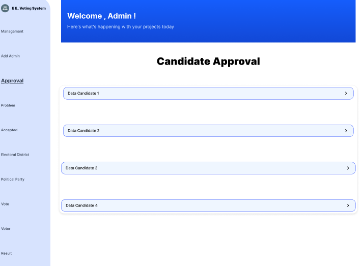
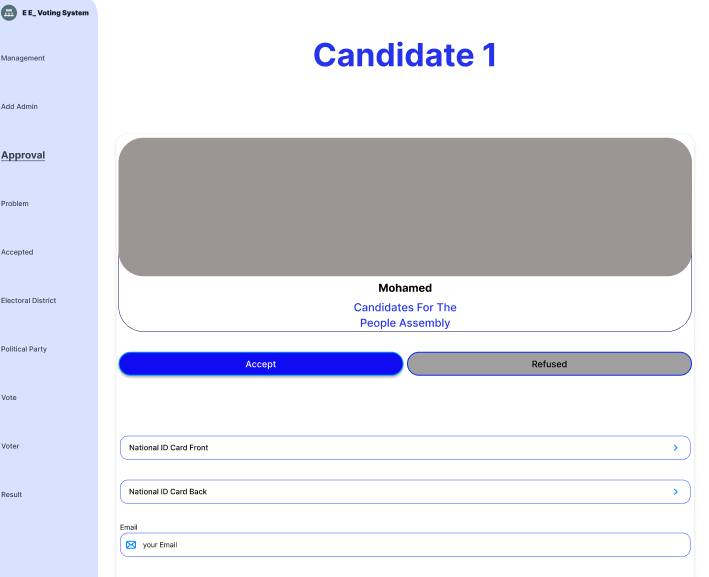
</p>

<p align="center">
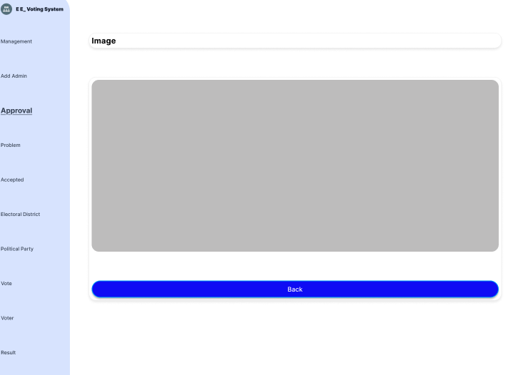
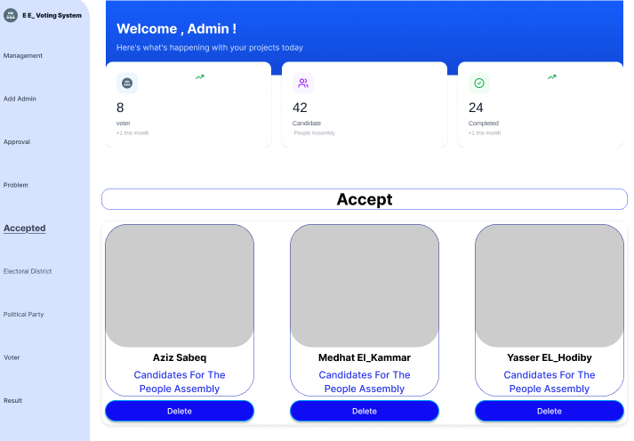
</p>

Review candidate applications, verify submitted documents and approve accepted candidates.

---

# 🗳 Vote Management

<p align="center">
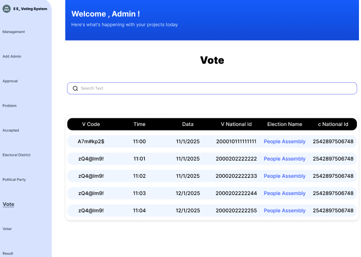
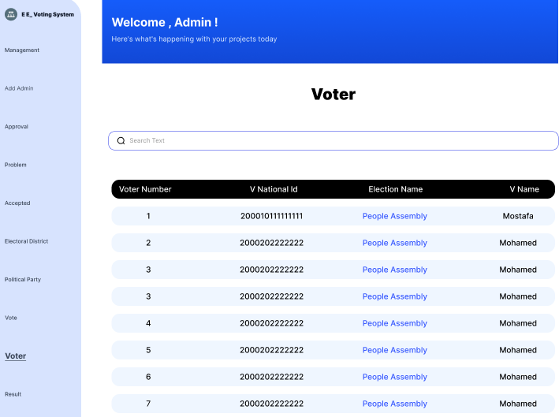
</p>

Monitor voting activity and review registered voters.

---

# 📊 Election Results

<p align="center">
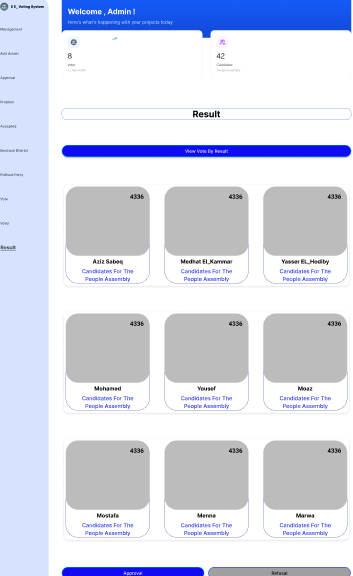
</p>

Display election statistics and final results.

---

# 📩 Contact & Support

<p align="center">
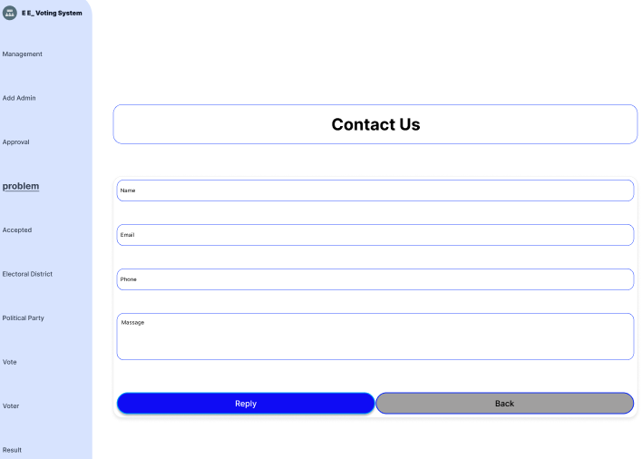
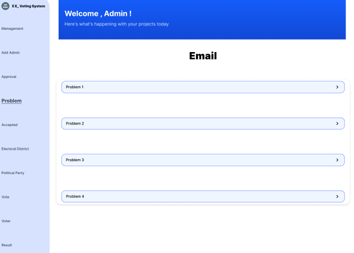
</p>

<p align="center">
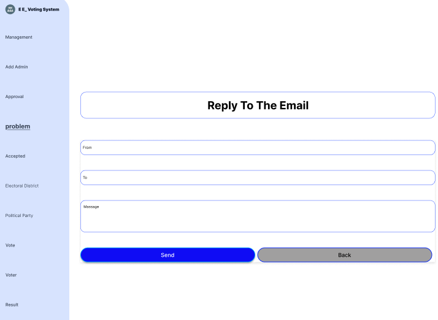
</p>

Receive user messages, review reported problems and send replies directly from the dashboard.

---

# 🚀 Getting Started

## Clone Repository

```bash
git clone https://github.com/Hazem-Abo-Hashem/Egypt-E-Voting-System.git
```

## Install Dependencies

```bash
npm install
```

## Start the Project

```bash
npm start
```

The application will run on:

```text
http://localhost:3000
```

---

# 📦 Main Dependencies

- React.js
- React Router DOM
- Axios
- HTML5
- CSS3
- JavaScript ES6

---

# 🔗 REST API Integration

The Admin Dashboard communicates with backend REST APIs for:

- Authentication
- Election Management
- Candidate Approval
- Electoral District Management
- Political Party Management
- Vote Monitoring
- Voter Management
- Election Results
- Contact Messages

---

# 👨‍💻 My Contribution

As the **Frontend Developer** of the graduation project, I was responsible for designing and implementing the complete **React-based Admin Dashboard**.

My responsibilities included:

- Designing responsive user interfaces.
- Building reusable React components.
- Integrating frontend pages with REST APIs.
- Implementing CRUD operations.
- Managing application routing using React Router.
- Displaying dynamic data retrieved from backend APIs.
- Organizing the frontend project structure.
- Improving usability and user experience.

---

# 📌 Repository Scope

This repository is intended to showcase **only the React Admin Dashboard** that I developed as part of the Egypt Electronic Voting System graduation project.

### Included in this repository

- React frontend source code
- UI components
- Routing
- API integration
- Styling
- Screenshots
- Project documentation

### Not included in this repository

- Flutter Mobile Application
- FastAPI Backend
- Database Schema
- SQLite Database
- Supabase Configuration
- AI Face Recognition Module
- OCR National ID Verification
- Authentication Server
- Deployment Configuration

These components belong to the complete graduation project and are maintained separately.

---

# 🎯 Purpose

The purpose of this repository is to demonstrate the implementation of the **React Admin Dashboard** and my contribution as the **Frontend Developer** within the graduation project.

---

# 📈 Future Improvements

Possible future enhancements include:

- Dashboard Analytics
- Dark Mode
- Two-Factor Authentication (2FA)
- Email Notifications
- Multi-language Support
- Better Accessibility
- Performance Optimization
- Responsive Improvements
- Role-based Permissions
- Audit Logs

---

# 📄 License

This repository is published for **educational** and **portfolio** purposes only.

---

# 👨‍🎓 Graduation Project

Faculty of Computers and Information  
El Shorouk Academy

---

# 👨‍💻 Author

**Hazem Abo Hashem**

Frontend Developer

GitHub:
https://github.com/Hazem-Abo-Hashem

---

# ⭐ Support

If you found this project useful, consider giving it a ⭐ on GitHub.

Thank you for visiting this repository.